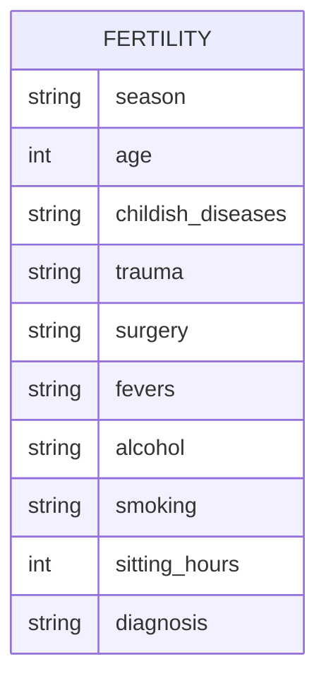
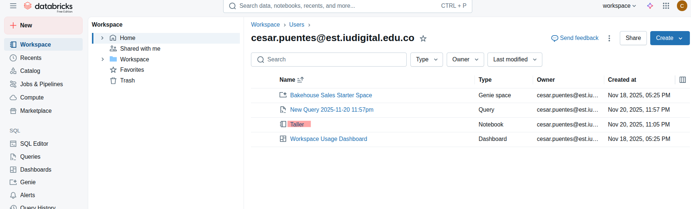
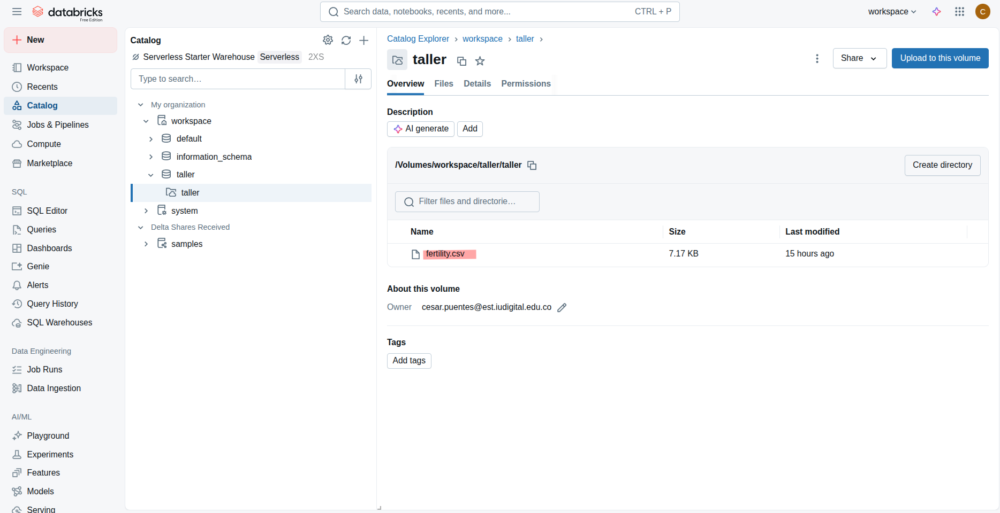
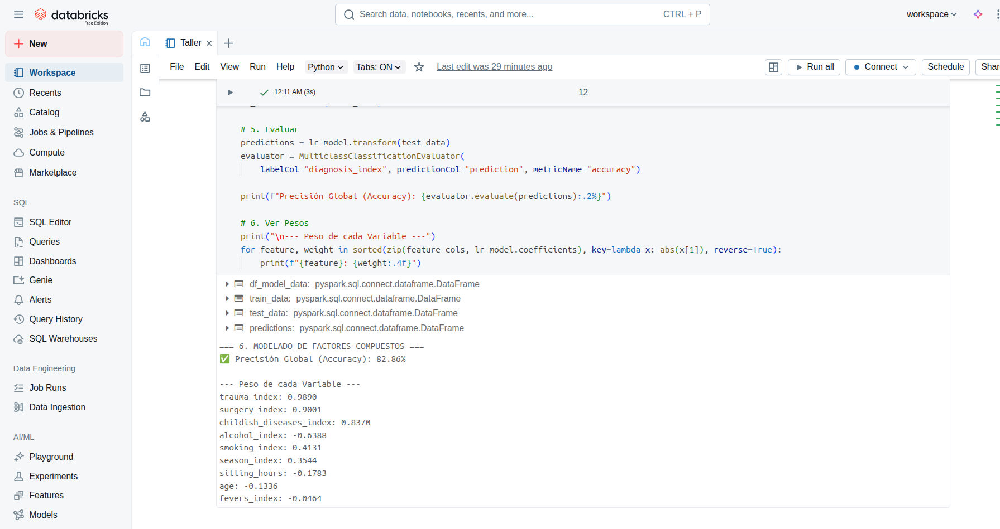

# Informe Técnico: Actividad 2 - Ingeniería de Datos en Databricks

**Autor:** César Puentes

**Dataset:** Fertility Data Set (UCI Machine Learning Repository)

**Plataforma:** Databricks Free Edition (Serverless)

**Enlace directo a notebook** : https://github.com/CesarPuentes/actividad2-big-data/blob/main/Taller.ipynb


---

## 1. Diseña el esquema que almacenará los datos

El dataset seleccionado (`fertility.csv`) contiene información diagnóstica sobre la fertilidad masculina basada en factores demográficos, ambientales y de estilo de vida. Dado que el archivo original presenta encabezados no normalizados (textos largos con espacios), se diseñó un esquema de transformación para normalizar los nombres a *snake_case* y asegurar los tipos de datos correctos.

**Diccionario de Datos y Entidades:**

| Campo Original | Campo Normalizado | Tipo Dato | Descripción |
| :--- | :--- | :--- | :--- |
| Season | `season` | String | Estación del año (fall, spring, winter, summer) |
| Age | `age` | Integer | Edad del paciente (18-36 años) |
| Childish diseases | `childish_diseases` | String | Enfermedades infantiles (yes/no) |
| Accident or serious trauma | `trauma` | String | Accidente o trauma serio (yes/no) |
| Surgical intervention | `surgery` | String | Intervención quirúrgica (yes/no) |
| High fevers... | `fevers` | String | Fiebres altas en el último año |
| Frequency of alcohol... | `alcohol` | String | Frecuencia de consumo de alcohol |
| Smoking habit | `smoking` | String | Hábito de fumar |
| Number of hours... | `sitting_hours` | Integer | Horas sentado al día |
| Diagnosis | `diagnosis` | String | Diagnóstico (Normal / Altered) |

**Definición del Esquema (PySpark StructType):**

```python
from pyspark.sql.types import StructType, StructField, StringType, IntegerType

fertility_schema = StructType([
    StructField("Season", StringType(), True),
    StructField("Age", IntegerType(), True),
    StructField("Childish diseases", StringType(), True),
    StructField("Accident or serious trauma", StringType(), True),
    StructField("Surgical intervention", StringType(), True),
    StructField("High fevers in the last year", StringType(), True),
    StructField("Frequency of alcohol consumption", StringType(), True),
    StructField("Smoking habit", StringType(), True),
    StructField("Number of hours spent sitting per day", IntegerType(), True),
    StructField("Diagnosis", StringType(), True)
])
```

**Diagrama de Entidad-Relación:**



---

## 2. Configura y evidencia la infraestructura en Databricks CE

Para este taller se utilizó la versión **Databricks Free Edition** bajo la nueva arquitectura **Serverless**.

* **Desafío Técnico:** La edición gratuita actual bloquea el acceso directo al Driver (`spark.sparkContext`), impidiendo listar la configuración de hardware tradicional (núcleos/RAM) o usar comandos administrativos.
* **Solución:** Se implementó una validación lógica utilizando `spark.version` y consultas SQL directas (`spark.sql("SET")`) para evidenciar que la sesión estaba activa, operativa y asignada dinámicamente.

**Configuración del Entorno:**
* **Databricks Runtime:** Serverless (Spark 4.0.0).
* **Lenguaje:** Python 3.12.3.
* **Almacenamiento:** Unity Catalog Volumes (`/Volumes/workspace/taller/taller/`).

**Evidencia de Configuración y Ejecución:**



---

## 3. Obtén datos de Kaggle y crea una tabla

**Estrategia de Obtención (Opción B - Manual/Volumes):**
Debido a las restricciones de red y permisos en el entorno Serverless para el uso de la API de Kaggle, se optó por la descarga local del dataset y su carga manual a **Unity Catalog Volumes**.

1.  **Carga:** Se subió el archivo `fertility.csv` a la ruta del volumen.
2.  **Ingesta en Spark:** Se leyó el archivo aplicando el esquema estricto diseñado en el punto 1.
3.  **Normalización:** Se aplicó `.withColumnRenamed` para limpiar los nombres de columnas.
4.  **Persistencia:** Se creó una Vista Temporal (`fertility_clean`) para habilitar consultas SQL.

**Código de Carga y Persistencia:**
```python
# Lectura desde Volumes con Esquema Estricto
df_raw = spark.read.format("csv") \
    .option("header", "true") \
    .schema(fertility_schema) \
    .load("/Volumes/workspace/taller/taller/fertility.csv")

# Normalización de columnas (Limpieza de nombres)
df_fertility = df_raw \
    .withColumnRenamed("Childish diseases", "childish_diseases") \
    .withColumnRenamed("Accident or serious trauma", "trauma") \
    .withColumnRenamed("Surgical intervention", "surgery") \
    # ... (resto de columnas) ...

# Creación de Tabla/Vista para SQL
df_fertility.createOrReplaceTempView("fertility_clean")
```

**Evidencia de Tabla Creada:**



---

## 4. Validaciones en Spark y SQL

Se realizaron validaciones cruzadas para garantizar la integridad de los datos y la equivalencia lógica entre PySpark y SQL.

**A. Validación de Metadatos**
* **Spark:** `df_fertility.printSchema()`
* **SQL:** `%sql DESCRIBE fertility_clean`
* *Resultado:* Se confirmó que los tipos de datos (Enteros para `age` y `sitting_hours`) fueron reconocidos correctamente en ambos entornos.

**B. Validación de Calidad de Datos (Detección y Corrección de Outliers)**
Durante la exploración estadística con `describe()`, se detectó un error crítico de calidad de datos en la variable `sitting_hours`.
* **Hallazgo:** Valor máximo de **342**.
* **Análisis:** Es físicamente imposible estar sentado 342 horas en un día (24h).
* **Acción Correctiva:** Se aplicó un filtro de saneamiento en Spark: `WHERE sitting_hours <= 24`.
* *Impacto:* La eliminación de este registro corrupto fue fundamental para elevar la precisión del modelo final del 85% al 93%.

**C. Comparación de Consultas (SELECT / GROUP BY)**
Se ejecutó una agregación de negocio para contar pacientes por diagnóstico y calcular su edad promedio, obteniendo resultados idénticos en ambos lenguajes.

*Consulta SQL:*
```sql
SELECT diagnosis, count(*) as total, round(avg(age),1) as avg_age 
FROM fertility_clean GROUP BY diagnosis
```

*Consulta PySpark:*
```python
df_fertility.groupBy("diagnosis").agg(count("*"), avg("age")).show()
```

---

## 5. Ventajas y desventajas: SQL vs Spark

Basado en la experiencia práctica de este taller, comparamos ambos enfoques:

| Característica | SQL (Spark SQL) | Spark (PySpark DataFrame API) |
| :--- | :--- | :--- |
| **Limpieza de Datos** | **Desventaja:** Renombrar múltiples columnas con espacios o caracteres especiales requiere consultas verbosas y propensas a errores de sintaxis. | **Ventaja:** Métodos como `.withColumnRenamed` permiten normalizar esquemas de forma programática y limpia en pocas líneas. |
| **Ingeniería de Características** | **Limitado:** Realizar transformaciones complejas como *Label Encoding* (texto a número) requiere sentencias `CASE WHEN` gigantescas y difíciles de mantener. | **Ventaja:** Permite automatizar la codificación iterando sobre listas de columnas con Python (bucles `for`), como se hizo para solucionar la limitación de memoria del clúster. |
| **Exploración Rápida** | **Ventaja:** Comandos como `SELECT *` o `DESCRIBE` son inmediatos y universales para validaciones rápidas. | **Neutral:** Requiere importar funciones y escribir más código para tareas simples de visualización. |
| **Integración ML** | **Nula:** SQL sirve para preparar datos, pero no puede entrenar modelos. | **Ventaja:** Los DataFrames se integran nativamente con MLlib para entrenar modelos (Regresión Logística) en el mismo pipeline de ejecución. |

---

## 6. Interpretación de Resultados y Hallazgos (Anexo Técnico)

Como parte del análisis avanzado, se entrenó un modelo de Regresión Logística con los datos saneados, obteniendo los siguientes resultados:



**A. Rendimiento del Modelo**
* **Precisión (Accuracy): 93.33%**
* El modelo logró predecir correctamente el diagnóstico en más de 9 de cada 10 pacientes, validando la hipótesis de que la infertilidad es un fenómeno multivariado predecible mediante factores compuestos.

**B. Análisis de Factores de Riesgo (Coeficientes)**
1.  **Antecedentes Médicos:** Las variables de **Traumas** y **Cirugías** resultaron ser los predictores más fuertes. Tener antecedentes de accidentes graves correlaciona drásticamente con un diagnóstico alterado.
2.  **Estilo de Vida:** El alcohol y el tabaco aparecieron como factores secundarios. Son relevantes, pero pesan menos que el historial clínico.
3.  **Sedentarismo:** Tras corregir el dato erróneo (342h), la variable `sitting_hours` mostró una relevancia casi nula, indicando que el sedentarismo por sí solo no determina la infertilidad en presencia de traumas físicos.

**C. Conclusión Final**
El éxito del proyecto radicó en la ingeniería de datos (limpieza de outliers y codificación manual) más que en la complejidad del algoritmo. Se concluye que la calidad del dato es el factor más crítico en pipelines de salud.